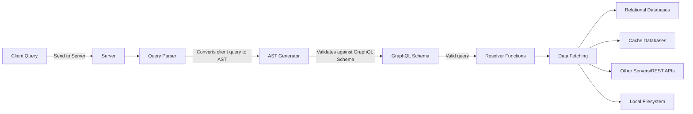

## Chapter 1: A Primer on GraphQL

### How Do GraphQL Communications Work?

When a query is received from the client, the server processes it using a query parser. The query parser reads and validates the query's format and checks it against the application's GraphQL schema. This validation ensures that only valid queries are accepted. The parser turns the query string into an abstract syntax tree (AST), which represents the query's structure. The AST includes fields, arguments, and other information and can be easily traversed by different language parsers.

Once the query is deemed valid, resolver functions come into play. Resolvers are responsible for populating the response with data for each field specified in the client query. They implement code logic to fetch the required data, which can involve querying relational databases, cache databases, or other servers on the network. Each field in the query has a corresponding resolver function responsible for returning the field's response.

It's important to note that resolvers are not limited to reading from databases. They can also read data from the local filesystem or make HTTP requests to external systems using REST APIs. This flexibility allows resolvers to gather data from various sources and generate the appropriate response for the client's query.



### What Problems Does GraphQL Solve?

GraphQL offers additional features, including schema stitching and schema federation. 

**Schema stitching** enables the creation of a unified GraphQL schema by combining multiple underlying GraphQL services. It allows multiple schemas to be packaged together, creating a single integration point for clients. This consolidation of schemas simplifies the integration process for clients and provides a unified view of the underlying services.

On the other hand, **Schema federation** provides a mechanism for consolidating multiple APIs into a single gateway without the need for manual schema stitching. Instead, developers specify where the GraphQL API gateway should locate additional schemas, and the gateway handles the stitching automatically. Federation offers a lower-maintenance approach to consolidating multiple APIs.

However, it's important to note that complex API applications that utilize schema federation or stitching can introduce security vulnerabilities. These vulnerabilities may grant unauthorized access to sensitive data. The complexity of such applications increases the likelihood of internal complexities leading to potential security issues. Therefore, proper security measures should be implemented to mitigate these risks.

### GraphQL APIs vs. REST APIs
 
GraphQL has some unique characteristics when it comes to HTTP methods and status codes:

- Despite GraphQL applications primarily using the POST method, it's worth testing the support for the GET method. This is important because accepting GET requests in GraphQL can expose potential vulnerabilities like cross-site request forgery (CSRF), which can be exploited by attackers.
- In REST APIs, HTTP status codes like 200 OK, 404 Not Found, and 401 Unauthorized are used to indicate the outcome of a request to the client. For instance, a REST API may return a 401 Unauthorized status code when a user provides incorrect login credentials. These status codes play a crucial role in communicating the request result to the client.
- In contrast, GraphQL APIs typically return a 200 OK status code for most responses, even if there are authorization errors or the requested resource doesn't exist. GraphQL indicates errors to the client by including an errors field as part of the response payload.
- However, there are cases where GraphQL may return a status code other than 200 OK. This can occur if the server encounters critical errors, such as a database failure or other backend issues. In such situations, GraphQL may return a 500 Server Error status code.
- The fact that GraphQL behaves differently from REST in terms of HTTP status codes can be advantageous for hackers. As developers often adopt newer technologies like GraphQL without customization or thorough research, it provides an opportunity for attackers. The deviation from standard HTTP status code principles in GraphQL responses can help evade security controls such as web application firewalls (WAFs) and escape detection when security operators look for anomalies in HTTP error codes, especially if they are not aware of GraphQL's behavior.


## Chapter 2: Setting Up a GraphQL Security Lab

### Installing GraphQL Hacking Tools

#### Clairvoyance

- This Python - based reconnaissance tool for GraphQL APIs, developed by Nikita Stupin ( @ \_nikitastupin ) and Ilya Tsaturov ( @ itsaturov ), allows you to discover schema information when introspection is disabled. 
- It works by abusing a GraphQL feature called field suggestions. Essentially, it reconstructs the underlying schema by sending queries crafted from a dictionary of common English words and observing the server’s responses.

#### InQL

- A tool developed doyensec - (InQL) Introspection GraphQL
- InQL can export any information it finds about the GraphQL schema to a variety of formats, making the application’s schema easier to read and understand. InQL also can perform other tasks, such as detecting potential DoS conditions.

#### Graphw00f 

- A Python - based GraphQL security tool to identify a GraphQL API’s specific implementation. 
- We built it primarily because GraphQL doesn’t generally advertise the type of engine it’s using under the hood. Graphw00f manages to fingerprint the implementation by sending a mix of valid and malformed queries to the server and observing the subtle differences in the returned error messages.
- It can currently fingerprint over 24 implementations, including the majority of the popular GraphQL servers in use today.

#### BatchQL

- A GraphQL security auditing script written in Python and developed by the security firm Assetnote.
- The tool is named after a GraphQL feature called batching that allows clients to send multiple queries in a single HTTP request.
- BatchQL attempts to identify flaws in GraphQL implementations related to the following vulnerability classes : DoS, CSRF, and information disclosure.

#### Command Injection Exploiter ( Commix )

- An open source project written in Python and developed by Anastasios Stasinopoulos. 
- Commix attempts to find and exploit command injection vulnerabilities in an automated fashion by fuzzing various parts of an HTTP request, such as query parameters or the request body, using specialized payloads.
- The tool is also capable of exploiting these vulnerabilities and can spawn a custom interactive shell, which penetration testers can use to gain a foothold in remote servers.

#### graphql-path-enum

- Written in Rust and developed by dee_see ( @ dee_see ), graphql - path - enum is a security testing tool that finds various ways to construct queries that reach a specific piece of data. By doing so, it arms hackers with information that could assist them in identifying authorization flaws.

#### EyeWitness

- EyeWitness is a web - scanning tool developed by Chris Truncer and Rohan Vazarkar that is capable of capturing screenshots of target web applications. 
- When scanning many websites in a penetration test, you’ll often find it useful to visually identify what’s running on them. 
- EyeWitness achieves this using a command line – based web browser ( also called a headless browser ) under the hood, which allows it to load dynamic web content, such as content loaded dynamically using JavaScript.

#### GraphQL cop

- A dedicated GraphQL security auditing utility based on Python. 
- GraphQL Cop audits GraphQL servers for information disclosure and DoS - based vulnerabilities. 

#### CrackQL

- A specialized brute - forcing tool for GraphQL that uses GraphQL language features to better optimize brute - force attacks against API actions that may require authentication. 


## Chapter 3: The GraphQL Attack Surface

### The Language

#### Subscriptions

- The subscription operation works bidirectionally : it allows clients to retrieve real - time data from a server, and allows servers to send updates to clients.
- Subscriptions are carried over a transport protocol, most commonly **WebSocket**, a real - time communication protocol that allows clients and servers to exchange messages at any given time over a long - lived connection.
- However, because the GraphQL specification doesn’t define which transport protocol to use for subscriptions, you might see consumers use other ones.
- WebSocket connections are prone to cross - site WebSocket hijacking ( CSWSH ) vulnerabilities, which happen when the server does not validate the origin of a client in the handshake process. 
- WebSocket connections can also be vulnerable to man - in - the - middle ( MITM ) attacks when the transport of messages isn’t carried over an encrypted channel such as Transport Layer Security ( TLS ). The existence of such vulnerabilities could have a security impact on actions carried over GraphQL subscriptions.

#### Operation Names

- Clients define these operation names, which means they can be completely random, making them a great way to potentially fool an analyst reviewing logs of GraphQL applications. 
- For example, imagine that a client sends a document using the operation name getPastes, but instead of returning a list of paste objects, they in fact delete all pastes.
- Because operation names are client - driven inputs, they could also potentially be used as attack vectors for injection. 
- **Some implementations of GraphQL allow special characters in operation names. The applications might store these names in their audit logs, third - party applications, or other systems. These could cause mayhem if not properly sanitized.**

#### Fields

- When a client misspells a field, the error message returned by a server that implements field suggestions will reference the field it believes the client was trying to call. 
- For example, if we sent a query for a paste with the field name of  **`titl`** in DVGA ( notice the typo ), the server will respond with suggested alternatives :  **`" Cannot query field \ " titl \ " on type \ " PasteObject \ ". Did you mean \ " title \ " ? "`**

#### Aliases

- Aliases allow clients to change a field’s response key to something other than the original field’s name. 
- For example, here we use myalias as an alias for the title field name : **`query { pastes { myalias:title } }`**
- **While aliases can typically contain alphanumeric characters, most GraphQL servers will return a syntax error when aliases contain special characters.**

#### Fragments

- Fragments allow clients to reuse the same set of fields in a GraphQL query for readability and to avoid field repetition. 
- Instead of repeating the fields, you can define a fragment once and use it whenever you need that particular set of fields.
- Fragments are defined using the fragment keyword, followed by any name you desire, and declared using the on keyword on an object type name :
```json
	query {
		pastes {
			... CommonFields 
		} 
	} 
	
	fragment CommonFields on PasteObject { 
		title 
		content 
	}
```
- From a penetration testing perspective, fragments can be constructed such that they reference one another, allowing for a circular fragment condition that could lead to DoS conditions.

#### Variables

- You can supply variables to operations as argument values by declaring them within the GraphQL document. Variables are useful because they avoid costly string building during runtime.
- Using the dollar sign ( $ ) symbol, we provide the variable name status and its type, Boolean. The ! after the variable type means that the variable is required for the operation.

#### Directives

- Directives allow you to decorate, or change the behavior of, a field within a document. 
- The behavior change could affect the way the particular field gets validated, processed, or executed by the application. 
- Directives can be seen as arguments ’ big brother, as they allow for higher - level control, such as conditionally including or skipping fields based on certain logic. 
- They come in two flavors : 
	- query level 
	- schema level. 
- Both types are declared with **`@`** and can leverage arguments ( much like fields ).
- Implementations typically provide several out - of - the - box directives, and GraphQL API developers can also create their own custom directives as they please. 
- Unlike operation names or aliases, clients can use only the directives defined by the server.
- Finally, the more recently added @ specifiedBy schema - level directive is used to provide a human - readable specification URL for a custom scalar type.
- Custom directives empower GraphQL implementations to develop new features or augment functionality not currently supported, or widely used, by the ecosystem. 
- One example of a widely adopted custom directive is **`@computed`**. This powerful schema - level directive saves implementers from having to create resolver functions for fields that can be computed from the values of other fields in the schema. 
- In the example below **`@computed`** directive can merge the firstName and lastName fields into the fullName field. 
```json
	type User { 
		firstName : String 
		lastName : String 
		fullName : String @computed ( value : " $ firstName $ lastName " ) 
	}
```

### Data Types

- GraphQL’s types define the custom objects and data structures that make up a GraphQL schema. 
- There are six kinds of types : **object, scalar, enum, union, interface, and input**.

#### Objects

- Custom object types are groups of one or more fields that define domain - or application - specific objects. 
- Consider the example schema below: 
```json
	type PasteObject { 
		id : ID ! 
		title : String 
		content : String 
		public : Boolean 
		userAgent : String 
		ipAddr : String 
		ownerId : Int 
		burn : Boolean
		owner : OwnerObject 
	}
```
- If you look at the id field, you’ll notice that it contains the **exclamation mark ( ! )** character. This means that every Paste object requires an ID, whereas every other field can be null. These required fields are known as non - null wrapping types.

#### Scalars

- Scalars include several core built - in value types, such as ID, Int, Float, String, and Boolean. Unlike object types, they don’t have their own fields.
- Custom scalars may also use the **`@specifiedBy`** built - in directive to describe their specification URL for clients. 
- For example, a custom scalar type UUID may set its specification URL to the relevant Internet Engineering Task Force ( IETF ) specification : 
```json
	scalar UUID @ specifiedBy (url : "https://tools.ietf.org/html/rfc4122")
```

#### Enums

- Enums, or enumeration types, are fields used to return a single string value from a list of possible values. 
- For example, an application may want to allow a client to choose how to sort a list of usernames in the response.
```json
	enum UserSortEnum {
	  ID
	  EMAIL
	  USERNAME
	  DATE_JOINED
	}

	input UserOrderType {
	  sort: UserSortEnum!
	}
	
	type UserObject {
	  id: Int!
	  username: String!
	}
	
	type Query {
	  users(limit: Int, order: UserOrderType): UserObject!
	}
```

#### Union

- A union is a type that returns one of many object types. A client can leverage unions to send a single request to a GraphQL server and get a list of objects.

```json
	query { 
		search ( keyword : " p " ) {
			... on UserObject { 
				username 
			}
			
			... on PasteObject { 
				title 
				content 
			} 
		} 
	}
```

- To accept and resolve a request like this, a schema can use a union type.

```json
	union SearchResults = UserObject | PasteObject 
	
	type UserObject { 
		id : ID! 
		username : String! 
	} 
	
	type PasteObject { 
	id : ID! 
	title : String 
	content : String
	}
	
	type Query { 
		search ( keyword : String ) : [ SearchResults ! ] 
	}
```

#### Interfaces

- Another way to return multiple types within the same field is through interfaces. 
- Interfaces define a list of fields that must be included across all object types that implement them. 
- In the union request example covered in the previous section, you saw how we could retrieve the username field of any User object, as well as the title and content fields of any Paste object, as long as these matched the search pattern. Interfaces do not work like this ; they require the same fields to be present in both objects in order for the objects to be joined in a response to the client.
- To implement our search functionality using interfaces instead of unions

```json
	interface SearchItem { 
		keywords : [String!] 
	} 
	
	type UserObject implements SearchItem { 
		id : ID! 
		username : String! 
		keywords : [String!] 
	} 
	
	type PasteObject implements SearchItem { 
		id : ID! 
		title : String 
		content : String 
		keywords : [String!] 
	} 
	
	type Query { 
		search (keyword : String) : [SearchItem!]! 
	}
```

- Interfaces could pose a problem in applications that poorly implement authorization. One way to implement authorization in GraphQL is by using custom schema - level directives. Because an interface defines fields to be used by other objects, any sensitive field that isn’t properly decorated could be exposed unintentionally. Large SDL files can have thousands of lines, and there is always a chance a developer might forget to add the relevant authorization directives.

#### Inputs

- Arguments are able to accept values of different types, such as scalars, but when we need to pass large and complex inputs to the server, we can leverage an input type to simplify our requests. Input types are essentially the same as object types, but they can be used only as inputs for arguments. They help organize client requests and make it easier for clients to reuse inputs in multiple arguments. Mature GraphQL deployments use input types to better structure their APIs and make their schema documentation easier to read.

### Introspection

- Introspection lets clients query a GraphQL server for information about its underlying schema, which includes data like queries, mutations, subscriptions, directives, types, fields, and more. 
- As hackers, this feature can be a gold mine in supporting our reconnaissance, profiling, data collection, and attack - vector analysis efforts. Let’s dive into how we can use it.
- The GraphQL introspection system has seven introspection types that we can use to query the schema. 

| Introspection type | Usage                                                                                 |
|--------------------|---------------------------------------------------------------------------------------|
| **`__schema`**         | Provides all information about the schema of a GraphQL service                        |
| **`__type`**           | Provides all information about a type                                                  |
| **`__typekind`**       | Provides the different kinds of types (scalars, objects, interface, union, enum, etc.) |
| **`__field`**          | Provides all information for each field of an object or interface type                 |
| **`__inputvalue`**     | Provides field and directive argument information                                      |
| **`__enumvalue`**      | Provides one of the possible values of an enum                                         |
| **`__directive`**      | Provides all information on both custom and built-in directives                        |

- **`__schema`**  introspection type against DVGA. 
```json
	query { 
		__schema { 
			types { 
				name 
			} 
		} 
	}
```

- We can use **`__type`** to further investigate information about types we find interesting. 
```json
	query { 
		__type (name: "PasteObject") { 
			name 
			kind 
			fields { 
				name 
				type { 
					name 
					kind 
				} 
			} 
		} 
	}
```

### Validation and Execution

- The GraphQL Threat Matrix ( https://github.com/nicholasaleks/graphql-threat-matrix) is a security framework for GraphQL. 
- It is used by bug bounty hunters, security researchers, and hackers to assist with uncovering vulnerabilities across multiple GraphQL implementations.